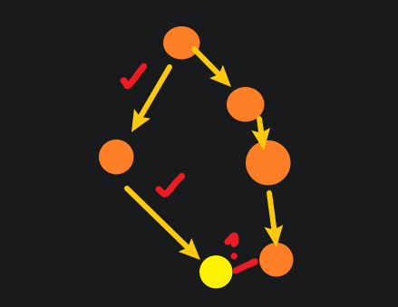
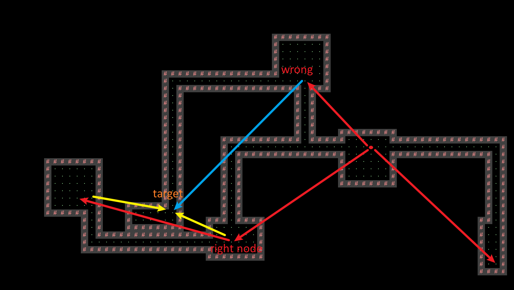

# Project 3

The point is to manipulate a 2D grid and place:
- rooms
- paths

I don't need to worry about the rendering and stuff. Every drawing, sizing, tilling problem is handled in the skeleton coded. Thank you so much! I just need to create a Tile[][] and feed it to the renderer.  
The problem being how to place the rooms in a messy way and occupy 50% of the grid, and the other problem is how to connect every single room on the grid.   
~~My idea is to generate at least 3*3 blocks, and keep generating at random so that the total area exceeds some amount. And also, keep their information in some list.~~   
~~Then, by the list, every rooms is connected by a 3 block wide path, until the last one is connected, then there will be one single path that connects all the room. Of course, it's boring.~~ Another idea is to store them in some kind of graph, that represents their actual location and distance, then use shortest path or something to find the order to connect them, then generate the paths. Hallways doesn't have to have turns, that's great news meaning that simply connect point to point is sufficient, only straight up down left right.  
Saving should work by storing seeds.   
> A very important thing to notice is that grid is bottom to top, so 0th row should be drawn at the bottom. 

## 1 Classes and Data Structure

### ~~Room~~

- length
- width
- x
- y

This is enough information to create room and have location, plus some methods like area(), draw(), etc., those work with the api. This should be information and not completely related to the placed tiles on the grid. The seperation makes the modification to walls easier. 

### ~~Hallway~~

- start x, y
- end x, y

This describes the hallway. Not sure if there is a need to variate width. 

### Probably Helper Class
There will be somewhere that handles with: 
- break walls for fusing overlapped rooms (if room placement are completely random)
- break walls for connecting hallway (basically breaking walls at desired blocks)

### ~~Graph~~
- LENGTH, WIDTH: grid bound
- int[2]: coordinate
- ArrayList: stores list of roots
- Java.util,hashMap: every node maps to a root, (a, b) → (c, d). This duplicates the space needed. 

### OriginNet (more like origin tree)
Used to store room origins for hallway connection. Should store them so when connecting, each is connected with the shortest distance from each other.
It should a tree like structure, most importantly it cannot have cycles. 
Wait it can have cycles. But for simplicity ignore cycles. 
Make a tree structure, and every node adds itself as a child of the closest node. At the end will yield a tree that spans out of one node, and connects to the closest node one by one. 
*Implementation*: Has to fulfill collection, to simplify things.  
OK if we stick to java.util, we can use a hashMap to map parent to children, use any list to store origins. The code would look like: 
```
    for (int[] node : origins) {
        if (map.contains(node)) { // skip if has no child
          for (int[] target : map.get(node)) { // for every child in the set mapped to node
            buildPath(node, target);
          }
        }
    }
    buildPath(int[] node, int[] target) {
        // this is the hard part. have to find a path by blocks. 
        /*
        Idea: build from x to target_x, then build from y to target_y. 
        Can vary by prioritizing the shorter/longer length. 
        This works because we only build straight path with one turn. Well actually this is applicable to swiggly path. 
        */
    }
```
However, the hashmap data structure doesn't maintain a tree-like structure during connection. And the algorithm failed to prevent cycles. 
Need to design a tree. 


### Origins
*Update*: the smart ide showed me `record`, `Origin` much simpler.   
*Update*: since hashmap needs hashing and it can't be default, created `Origin` class just for that.  
Origins are arbitrary point within a room that is used for connecting rooms. 
any coordinate is denoted as two integers, for now we put them in a int[2].

## 2 Algorithm

### ~~Rooms~~
*\*This is pretty much the final decision, however the consideration of different cases or `Room` class is abolished.*  
Rooms have an origin coordinate at the bottom left. There are two ways to put them: 
- Random  
generate random origin and size, repeate until total area > 50% of grid. This bring 3 cases:
  - room A and room B are separated. Edge case they are side by side with walls touching
  - room A falls inside of room B, as room A is completely smaller than B (length and width), therefore completely surrounded by B. In this case room A should be cleared. 
  - room A intersects with room B, means A is longer or wider than B and their walls intersect. In this case fusing the rooms by breaking some walls results in one bigger room with non-rectangular room. But this only makes building hallways harder. 
- Careful  
place a room, record it, then place another which does not fall into its territory, repeat. This approach is more complicated and does not produce overlaps, which is actually a way of dismorphing room shapes. 

### ~~Graphing~~
  Instead of just randomly place rooms, randomly place dots. Randomly place a dot on an empty grid, which will be the ancestor block. Then continue recursively doing 2 things, randomly select dot and grow dot. 

  - for some random dot chosen, it is an ancestor by its own
  - for an ancestor block, grow its territory by spawning blocks around it, side by side, in some clever way so they get into shape. This way ancestors spawned earlier grows to larger, continuous area, and later ancestors grows into smaller areas that disfigures the map.     
  
  Now is the genius part. Every block is a vertex in a graph, that's right. Instead of drawing "rooms and corridors" on the grid, this approach would be storing singular blocks into a graph, their physical distance becomes weigth of edges. Also, there would be a topology that represents areas: every block (vertex) would be pointing to another block, eventually ending at a single block which is the ancestor. When there are gaps in the grid, different blocks points to different ancestor, which on the graph is represented as disconnected. Let's call these disconnected areas with different ancestors "continent". When continents grow, they are separated by space, and eventually comes in contact. At this time the two continents merges and one ancestor now points to another, being one big continent with one ancestor. No hallway is specifically needed.   

  This spawning ancestors and growing, merging continents stops when `totalArea > 50% grid && noDisconnectedContinent`.   

  Everything is "reduced" to a graph problem. Amazing. I'm such a genius. This also means that I can just use Java.util.graph if there is one, without need of making my own implementation. After all this project is about software engineering rather than data structure.   

  There will be some features about this graph. 
  1. It has one single root at the end.   
  For every continent it has only one ancestor (root), and when continents merge there will be only one ancestor since the other is added to it. Since every continent will be and should be connected eventually, the whole graph will have only one root. 
  2. It has a tree like structure.   
  Every continent has one root, every non-root vertex would point to another vertex that eventually points to the root, or simply points to the root. Therefore, every non-root vertex will trace to one root, with no cycle, no second root. 
  3. It has a DAG like structure.   
  The only precedence that matters is that vertices belongs to root, so however the other vertices points to one another does not matter. As long as the root is at the beginning of the topology sort. 
  4. It is composed of all floor blocks.   
  That's right, all the dots blocks mentioned are floors, because when the final world is finished, to build walls is simply wrapping the continent with wall blocks. Simply check if a block is `noneBlock && isNeighborToFloor()`, and place a wall block there. This also works for inland lakes. 

This is probably the most brilliant idea I can ever have.  

Another advantage of this approach is that growing the continent, we can add the new vertices into a queue, which just manages how we should populate the land. However, when continents merge the queues are harder to manage, as simply adding to the end may cause disproportion.  

Actually this also works if we place rooms, since the genius of it is generating floors first then walls. It's just that rooms are not as easy to trace as vertices in graph. And it would be more efficient to track rooms instead of thousands of blocks. And it makes the rooms more rectangular.

This idea is not adopted because it is harder to implement than I think. To avoid QR code from continuously spawning blocks at random, sophisticated expansion is needed. However, there is no clever way (from me) to expand a room-like shape, that is not circle but still varies varies in shape. 

### Room with Origin
We don't need to manage all blocks. That way we don't need a object.    
Generate a square room, pick any one block as origin, continue to spawn, no need to worry about overlapping.   
When room area is large enough, for each origin build a path to the closest origin with one turn. The turn will likely fall in the room area so the hallway appears straight.   
Since origins search the closest origin as if breadth first search, as if shortest path, should be good.   
~~Origin search can be maintained in a graph or something during spawning to save runtime.~~  
In the current design, with list and map, origins should not be connected during generating because the algorithm that adds new nodes is so simple that it doesn't maintain itself like a heap, making the scenario that even though a newly spawned node is a better candidate for connection, it is ignored.   
In the new algorithm, the connection is executed after room generation; however, cycle is not prevented because simply looking for the closest origin would cause far land to connected to each other, especially with the list and map data structure. Tracing down the mapping would work but I want to avoid that because typical case is there is no cycle but the algorithm traced down the whole map, for every node. 
**We need a tree-heap-like data structure.**  
Here is the algorithm for maintaining a tree like structure. It works by calculating the distance between `o` and each `child`, and find the closest, then repeat for the closest. 
If the closest is `parent`, end recursion. It still uses a hashmap but treats it as a tree. Instead of looking for the closest from the list, it looks for the closest in the tree, which is faster and ensures acyclicity.  
However, it doesn't maintain itself like a heap, the structure is simply a tree with more than 2 branches. It has no rotation operation, nor has it red-black attributes, simply because I can't. 
```
    for (Origin o : list) {
        tree.findClosest(o, tree.first); 
    }

    findClosest(o, parent) {
        min = distance(o, parent);
        for (Origin child : parent) {
            if (distance(o, child) <= min) {
              min = thisdistance;
              closest = child;
            }
        }
        if (closest = parent) tree.insert(o, parent); return;
        findClosest(o, closest);
    }
```
There is still some wrong closest. It's not the calculation. The tree traverses down branches, but the closest node is not guaranteed to be a child of the closest branch.
In the image the red arrows are normal, a root points to its closest children. But the blue arrows are wrong and should be yellow. 
I presume this happens cuz target was added, wrong node is already in the tree, but right node is not. 
As a result, target connects to wrong node, since right node doesn't "exist". Then when right node is inserted into the tree, target doesn't bother to find it, because it was already iterated. 
Fixing by inserting during spawn won't work because the list reflects the order of spawn. 



Fixed, or not fixed, by a brute force insertion. It's not even a tree or a heap or anything and works really dumb. 
Everytime a new node inserts, find the closest, and add it to its child. Simply wasting space cuz every hash set contains one child. 
Every node gets two connections, its child and its parent. The child will never change, but many node will add it to their children. 
Like a reversed tree, the branches points to the parent. This still doesn't fix the long path problem cuz it doesn't modify any relationship. 
Good news is we already have a simple function that calculates the distance, could be of use. 
~~Path finding should find path with shortest length, using something like weightedd or dynamic planning.~~ I don't even know what I'm saying here.  
~~Try this: When generating new rooms, detect first whether the point is a floor. If yes, skip; if no, spawn room. This way we can avoid a lot of overlaps.~~  
No it doesn't work. There is no significant difference. If any it actually increase side by side rooms which is uglier. 

### centering
Another idea of connecting origins is to instead of calculating over and over the distance between the origins, simply calculate their distance to the center of the screen. 
That way they have a value that's unique to them, meaning that they can be operated like a heap. Well actually this works as well if we pick any `Origin` to act as the center. 

### ~~Hallway~~
This is so much harder.  
The point is to, first, have two rooms with no other room in between, then find two points on the wall that lies on the same line, connect them, break room wall and place hallway walls. All these steps are hard.   

### Walls
No matter which idea is implemented, this one stays. 
Iterate through every block, if floor skip. If empty, check if has floor neighbour, put wall.   
This makes sure every floor is not exposed to void, even though rare cases a single wall in the middle of the room occurs, but it's fine.  
We can also make it faster by tracking exterior during spawning, but it's not so important at this stage. 

### Ideas
1. A way to generate rooms is to select random dots in the grid, expand them randomly until they grow to various sizes. This way it is similar to using noise function which I don't know about. Maybe should try. 
2. A hallway is also a type room, with special case that they are restricted to 3 blocks of width, or length. 

## Persistence (Saving)
First idea is storing the seeds used in the Random obj, in this way recreating the world means to run the whole algorithm again. 
Another idea is to really store the grid in some way, toString, serializing, encoding; however, this approach requires implementation of io operation, which is very annoying.  